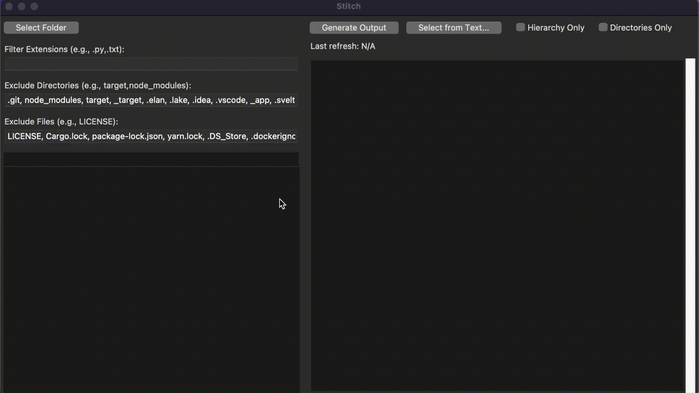

Stitch is a lightweight, cross-platform desktop utility built with Python and Tkinter. Its primary purpose is to help you select specific files and directories from a project, and then "stitch" them together into a single, consolidated text file.



🎥 [Watch Full Demo (1:24) on YouTube](https://www.youtube.com/watch?v=kN6z7ULb5Es)

## 📚 Table of Contents

- [Core Philosophy](#-core-philosophy)
- [Goals and Purpose](#-goals-and-purpose)
- [Features](#-features)
- [Future Roadmap](#-future-roadmap)
- [Getting Started](#-getting-started)
- [How-to-Use](#-how-to-use)
- [Known-Issues](#known-issues)
- [Contributing](#-contributing)
- [License](#-license)

***

## 💡 Core Philosophy

Stitch is designed to work with the **LLM chat interfaces** you already use, not with expensive API keys.

The point is to let you use powerful models through your normal, affordable subscriptions. Most "AI" features in IDEs use API calls that can get expensive fast. With Stitch, you trade a few seconds of copying and pasting for **big savings** 💰, while still getting great, AI-ready context.

Plus, **you're in complete control**. Many AI tools are 'black boxes'; you don't really know what context they're sending or how it's structured. With Stitch, you decide exactly what goes into the prompt. Since you know your project best, you can create a perfect context that an automated tool might get wrong. It's totally possible that with a little effort, your hand-picked context will get you **better results** from the LLM than the automatic tools can.

***

This tool is particularly useful for creating comprehensive context files for LLMs, generating project snapshots for documentation, or packaging code for review.

## 🎯 Goals and Purpose

* **Context Generation**: Quickly generate a single, easy-to-read context file from a complex project structure to be used with AI models.
* **Code Archiving**: Create a snapshot of selected parts of a project, including both the file structure and content, in a single text document.
* **Simplified Sharing**: Package relevant code files into one portable format for easy sharing and review, without needing to create a zip archive.
* **Ease of Use**: Provide a simple, intuitive graphical user interface that requires no complex setup or dependencies.

***

## ✨ Features

* **Interactive Tree View**: Select a root folder and navigate its contents in a hierarchical tree.
* **Selective Inclusion**: Use checkboxes to precisely select which files and directories to include in the output.
* **Powerful Filtering**:
    * Filter files by one or more extensions (e.g., `.py, .js, .css`).
    * Exclude common directories (like `.git`, `node_modules`, `venv`).
    * Exclude specific files (like `.gitignore`, `LICENSE`).
* **Flexible Output Modes**:
    * **Full Output**: Generate the file hierarchy and the full contents of every selected file.
    * **Hierarchy Only**: Generate only the file tree structure.
    * **Directories Only**: Generate a hierarchy tree composed only of the selected directories.
* **Select from Text**: Paste a previously generated hierarchy into the app to automatically re-select the same set of files.
* **Auto-Refresh**: The application can detect file system changes (new files, modifications) and update the output automatically.
* **Zero Dependencies**: Runs out-of-the-box with a standard Python 3 installation.

***

## 🚧 Future Roadmap

Here's a list of potential features and improvements being considered for future releases. These are currently unplanned but may be developed if they are frequently requested or prove essential.

### Filtering & Selection
* **Filter Profiles**: Save and load different sets of filter configurations (extensions, excluded files/dirs) for various project types, like a "Python Backend" or "React Frontend" profile.
* **Exclusion Filters**: In addition to whitelisting extensions, add a "blacklist" feature to explicitly **exclude** files by extension (e.g., `-.log`, `-.tmp`).
* **Regex Pattern Matching**: Allow the use of **regular expressions** for more powerful and precise filtering of file and directory names.
* **"Always Include" Files**: Create a special list for files (like `README.md` or a key config) that should **always be included** in the output, overriding modes like "Hierarchy Only."

### Output & Export
* **Token Count Estimation**: Display an **estimated token count** for the selected files to help manage context size when preparing prompts for Large Language Models (LLMs).
* **Direct Copy/Save**: Add a one-click **"Copy to Clipboard"** button and an option to **save the output** directly to a `.txt` or `.md` file.
* **Optional Line Numbers**: Add a checkbox to include **line numbers** within the file content blocks, making it easier to reference specific lines of code.

### User Experience & Interface
* **Command-Line Interface (CLI)**: Develop a non-GUI version of Stitch for power users and for integration into **automated scripts and workflows**.
* **Recent folders**: Maintain a history of recently used folders for quicker access.
* **Drag and Drop**: Allow users to **drag a folder** directly onto the application window to select it as the root directory.

***

## 🚀 Getting Started

Getting Stitch up and running is incredibly simple, as it has no external dependencies.

### Prerequisites

You need to have **Python 3** installed on your system. The application uses `tkinter` for its graphical interface, which is part of the standard library on Windows and macOS.

On some Linux distributions, you may need to install it separately if it's not included with your Python installation.

* **On Debian/Ubuntu:**
  ```
  sudo apt-get update
  sudo apt-get install python3-tk
  ```
* **On Fedora:**
  ```
  sudo dnf install python3-tkinter
  ```

### Running the Application

1.  **Clone or Download the Project**:
    Get the project files onto your local machine.

2.  **Navigate to the Directory**:
    Open your terminal or command prompt and change into the project's root directory.
    ```
    cd path/to/stitch
    ```

3.  **Run the Script**:
    Execute the `main.py` file using your Python interpreter.
    ```
    python3 main.py
    ```
    The Stitch application window should now appear.

***

## 📖 How to Use

1.  **Select a Folder**: Click the **"Select Folder"** button to choose the root directory of the project you want to work with.
2.  **Filter Files (Optional)**:
    * Use the **"Filter Extensions"** field to show only files of certain types (e.g., `.py, .md`).
    * Adjust the **"Exclude Directories"** and **"Exclude Files"** fields to hide items you don't need. The lists are pre-populated with common defaults.
3.  **Select Items**:
    * Click the checkbox `[ ]` next to any file or directory in the tree on the left to include it.
    * Selecting a directory automatically selects all its children. You can then uncheck specific children if needed.
4.  **Generate Output**: Click the **"Generate Output"** button. The right-hand text area will be populated with the file hierarchy and the contents of your selected files.
5.  **Copy the Result**: The generated text is ready to be copied and pasted wherever you need it.


### Using "Select from Text"

The **"Select from Text..."** feature is a powerful way to quickly restore a previous selection or implement an advanced workflow with Large Language Models (LLMs).

#### Standard Use

You can save a hierarchy generated by Stitch and reuse it later. For example, if you selected a set of files:

```
cool_project
├── README.md
├── main.py
└── other_files
    ├── utils.py
    └── config.json
```

You can save this text. Later, open Stitch, select the `cool_project` folder, use **"Select from Text..."**, and paste the block to instantly re-select the same files.

#### Advanced Workflow: LLM-Powered Context Selection

A more powerful way to use this feature is to let an LLM identify the most relevant files for a specific task. This creates a highly-focused context for your follow-up prompts.

1.  **Generate a Broad Context**: Start by selecting the root folder in Stitch to capture all potentially relevant files. Use the filters to exclude obvious non-code directories (`.git`, `venv`, etc.) to create a broad, but clean, project overview.

    * **Pro Tip**: Aim for a context size that uses about 50% of your LLM's maximum window. This provides a rich overview without overwhelming the model. If the whole codebase is less than 50% of the LLM's context window, you can use the entire project. If it's larger, you may need to be more selective.

2.  **Ask the LLM for a File List**: In a chat with a capable reasoning model, use a prompt like the one below. The goal is to ask the model to act as a filter. Feel free to change the initial question to fit your specific task.

    ```
    I need to implement 'insert new feature here'.
    Which parts of the project below are relevant for this task?
    Only output the file hierarchy that is strictly necessary and nothing else.

    <PASTE THE ENTIRE PROJECT CONTEXT FROM STITCH HERE>
    ```

3.  **Auto-Select in Stitch**: The LLM will return a minimal file hierarchy. Copy this text block. Back in Stitch, click **"Select from Text..."** and paste the hierarchy. Stitch will parse it and automatically check only the relevant files in the tree.

4.  **Generate Minimal Context**: Click **"Generate Output"** one more time.

5.  **Start a New, Focused Chat**: It is highly recommended to start a *new, clean chat* with your LLM and provide this new, minimal context, along with a more in depth explanation about the task you want to accomplish. This ensures the model has only the most relevant information for the task, leading to lower costs, better focus and more accurate results.

While this workflow could be automated with a "Bring Your Own Key" (BYOK) approach directly within Stitch, the current manual process remains highly effective without adding implementation complexity.

***

## ⚠️ Known Issues

* **Huge Project Directories**: Stitch can struggle with extremely large directories, especially those containing thousands of generated or binary files (e.g., `venv`, `node_modules`). If you encounter performance issues, the best solution is to add these folders to the exclusion filter. While many common folders are excluded by default, you can always add more. If you believe a folder should be a default exclusion, please consider creating a pull request.

  * **Instant Freeze on Selection**: In the unfortunate case that selecting such a big folder freezes the entire application instantly, you won't be able to use the UI to update the filters. The workaround is to edit the default exclusion list directly in the code:
      1.  Open the `main.py` file in a text editor.
      2.  Find the relevant lines (```self.exclude_dirs_entry.insert(...)```, ```self.exclude_files_entry.insert(...)```) where the default exclusion lists are defined.
      3.  Add the name of the directory/file that is causing the issue.
      4.  Save the file and relaunch Stitch. The app will now ignore that directory/file from the start, preventing the freeze.

***

## 🤝 Contributing

Contributions are welcome! If you have a feature idea, find a bug, or want to add a common folder to the default exclusion list, feel free to open an issue or submit a pull request.

***

## ⚖️ License

This project is licensed under the MIT License. See the [LICENSE](LICENSE) file for full details.

Copyright (c) 2025 Giovanni Ramistella